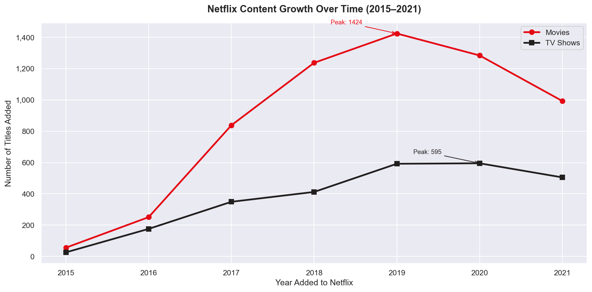
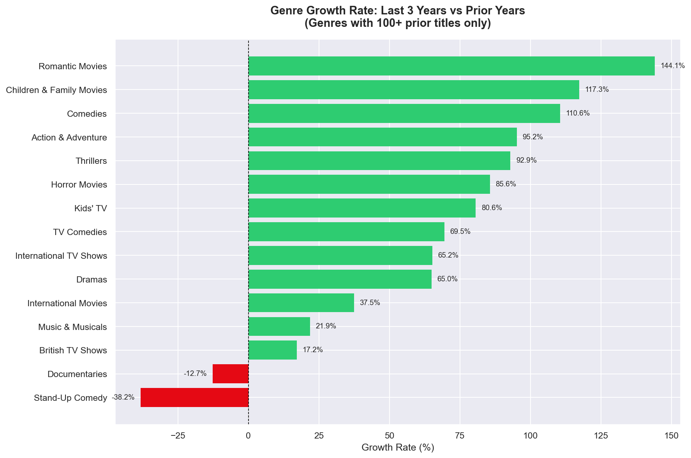
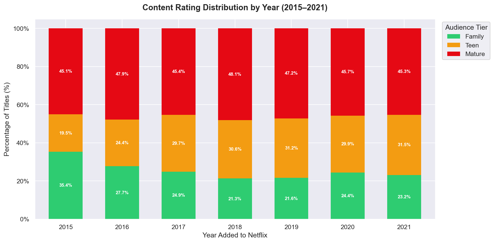
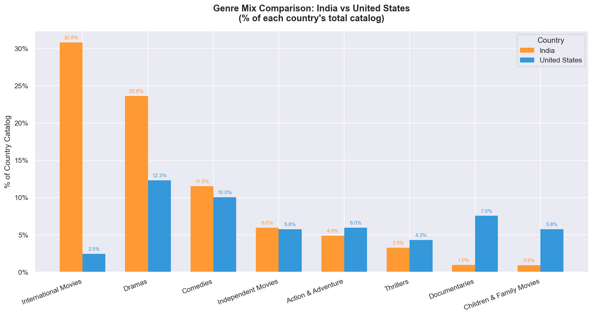
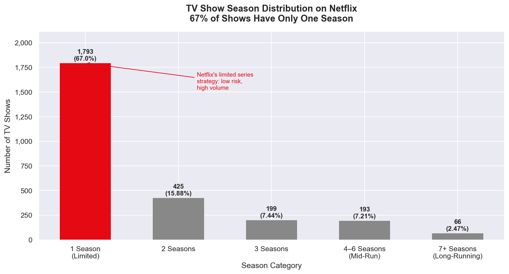

# Netflix Content Strategy Analysis

A full-stack data analysis project examining Netflix's content catalog across growth trends, geographic strategy, audience targeting, content format, and talent partnerships — using SQL, Python, and Excel.

---

## Project Overview

This project moves beyond simple descriptive queries to answer strategic business questions a real content team would ask. The goal is not just to describe what is on Netflix, but to analyse **what Netflix should do next** based on patterns in the data.

**Dataset:** 8,807 Netflix titles (2008–2021). Trend analysis focuses on 2015–2021 due to insufficient sample size in earlier years (fewer than 30 titles per year before 2015).

---

## Tools & Technologies

| Tool | Purpose |
|------|---------|
| SQL (PostgreSQL / pgAdmin4) | Primary analysis — 13 business queries |
| Python (Pandas, Matplotlib, Seaborn) | Visual EDA — 5 charts |
| Excel (Pivot Tables, Dashboard) | Business reporting layer |

---

## Repository Structure

```
Netflix-Content-Strategy-Analysis/
│
├── data/
│   └── netflix_titles.csv
│
├── sql/
│   └── netflix_analysis.sql
│
├── python/
│   ├── netflix_eda.ipynb
│   └── charts/
│       ├── chart1_content_growth.png
│       ├── chart2_genre_growth.png
│       ├── chart3_rating_shift.png
│       ├── chart4_india_vs_us.png
│       └── chart5_season_distribution.png
│
├── excel/
│   ├── netflix_dashboard.xlsx
│   └── screenshots/
│       └── excel_dashboard.png
│
├── reports/
│   └── content_strategy_report.md
│
├── business_questions.md
└── README.md
```

---

## Business Questions Answered

### Content Mix & Growth
1. How has the Movies vs TV Shows mix changed year over year?
2. Which genres have grown fastest in the last 3 years, and which are shrinking?
3. What is the average gap between a title's release year and when it was added to Netflix?

### Geographic Strategy
4. What are the top 5 content-producing countries and their dominant genre each?
5. How does India's genre mix compare to the US?
6. Which countries have shown the fastest growth in content output year over year?

### Audience & Rating Strategy
7. How has the distribution of content ratings shifted over the years?
8. Which genres skew toward mature vs family-friendly ratings?

### Content Format
9. How has average movie duration trended over the years?
10. What is the distribution of season counts across TV Shows?

### Talent & Partnerships
11. Who are the top 10 most frequently credited directors on the platform?
12. Which actors appear most frequently across different countries' content?

### Data Quality
13. What percentage of records are missing director, cast, or country information, broken down by content type?

---

## Key Findings

### 1. Content Peaked in 2019 and Has Been Declining
Netflix added 2,016 titles at peak in 2019. Since then, total additions have declined each year — Movies fell 30% from peak while TV Shows proved more resilient, declining only 15%.

### 2. Romantic Movies and Children's Content Are Growing Fastest
Among genres with 100+ prior titles, Romantic Movies grew 144%, Children & Family Movies grew 117%, and Comedies grew 110% in the last 3 years vs prior years. Stand-Up Comedy declined 38% and Documentaries declined 13%.

### 3. Mature Content Is Stable — Teen Content Is the Real Growth Story
TV-MA content has remained stable at 45–48% every year. The real shift: Family content declined from 35% (2015) to 23% (2021) while Teen content grew from 19% to 31%. Netflix is becoming more teen-oriented, not more adult.

### 4. India's Catalog Is Under-Diversified vs the US
India's top 3 genres account for 66% of its catalog vs only 30% for the US. India has almost no Documentaries (1% vs 7.5% in US) — a significant content gap and potential opportunity.

### 5. 67% of Netflix TV Shows Are Single-Season Limited Series
Of 2,676 TV Shows, 1,793 (67%) have only one season. The catalog follows a steep commitment pyramid — each additional season tier roughly halves the number of shows. This reveals Netflix's deliberate low-risk, high-volume commissioning strategy.

---

## Visual EDA — Python Charts

### Chart 1: Content Growth Over Time


Movies and TV Shows both peaked in 2019. Movies fell sharply post-peak while TV Shows held their ground — confirming TV Shows are Netflix's more resilient content format.

---

### Chart 2: Genre Growth vs Decline


Romantic Movies (144%) and Children & Family Movies (117%) lead growth among established genres. Stand-Up Comedy (-38%) and Documentaries (-13%) are in clear decline — Netflix is shifting from unscripted to scripted content.

---

### Chart 3: Audience Rating Distribution by Year


Mature content stays flat at ~46% across all years. The visible shift is Family content declining as Teen content rises — Netflix's audience targeting is moving toward young adults, not simply toward mature viewers.

---

### Chart 4: India vs US Genre Mix


India's catalog is heavily concentrated in three genres while the US spreads evenly across eight or more. India's Documentaries and Children's content share is a fraction of the US — representing both a gap and an opportunity.

---

### Chart 5: TV Show Season Distribution


67% of Netflix TV Shows have only one season. The steep dropoff from 1,793 single-season shows to 425 two-season shows reveals a deliberate low-commitment commissioning strategy — greenlight many, renew few.

---

## Excel Dashboard


The Excel file (`excel/netflix_dashboard.xlsx`) contains three sheets:

- **Data** — raw Netflix dataset (8,807 rows)
- **Analysis** — pivot tables and reference tables used as chart sources
- **Dashboard** — 4 KPI cards and 4 interactive charts built from pivot tables

**Note:** Country and genre fields contain comma-separated multiple values per row. Excel pivot analysis uses exact string matching and may undercount multi-value entries. Accurate split-value analysis is in the SQL file.

---

## Data Cleaning Approach

Cleaning was performed **contextually per query** rather than globally — NULL values excluded only where relevant to each specific analysis, preserving maximum data for unaffected columns.

| Issue | Rows Affected | How Handled |
|-------|--------------|-------------|
| Missing director | 2,634 (30%) | Excluded only in director-specific queries |
| Missing country | 831 (9.4%) | Excluded only in geography queries |
| Missing cast | 825 (9.4%) | Excluded only in cast queries |
| Missing date_added | 10 (0.1%) | Excluded in all date-based queries |
| Dirty rating values (duration in rating field) | 3 rows | Identified and excluded from all rating analyses |
| Duplicate show_id | 0 | Confirmed clean — no action needed |

---

## How to Run

### SQL
1. Install PostgreSQL and pgAdmin4
2. Create a new database
3. Open `sql/netflix_analysis.sql`
4. Update the file path in the COPY command to your local `netflix_titles.csv` location
5. Run the full script

### Python
1. Install dependencies:
```bash
pip install pandas matplotlib seaborn
```
2. Open `python/netflix_eda.ipynb` in Jupyter Notebook or VS Code
3. Run all cells in order

### Excel
1. Open `excel/netflix_dashboard.xlsx`
2. Navigate between Data, Analysis, and Dashboard tabs
3. All pivot tables are pre-built and connected to the Data sheet

---

## Project Limitations

- Dataset covers Netflix titles up to approximately 2021 — findings reflect historical strategy, not current catalog
- 91% of TV Show records have no director attributed — structurally expected as TV episodes have rotating directors per episode, not a data quality issue
- Minor row-count discrepancies (~0.1%) exist between SQL and Excel due to date field text formatting differences — SQL results used as primary reference

---

## Author

**Misba Khatoon**  
MCA Graduate | Data Analyst  
📧 misbakhatoon910@gmail.com  
🔗 [LinkedIn](https://www.linkedin.com/in/misba-khatoon-5067a3302)  
🐙 [GitHub](https://github.com/misba-coder)
